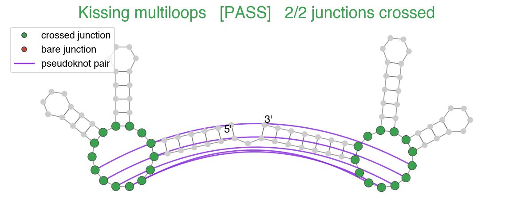
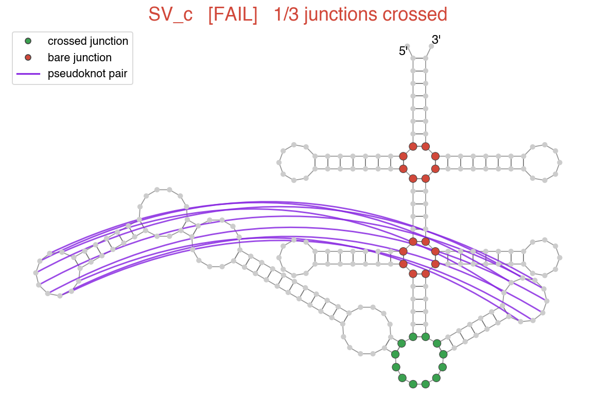

# eterna-crossed-junctions

A prototype **"crossed-junction" constraint** for RNA secondary structures, headed
for the [Eterna](https://eternagame.org) game.

## Motivation

For an upcoming Eterna challenge (complex ~240-nt designs for cryo-EM, following the
Mol9 *Kissing Multiloops* playbook), we want to reward structures whose **multiway
junctions are "crossed"** — i.e. each junction is touched by a pseudoknot.

The intuition comes from the Das/Janelia cryo-EM group (`#janelia_rnacryoem` Slack
thread, Jul 2026): a bare 3-/4-way junction with no designed tertiary contact tends
to swap coaxial-stacking conformations and be hard to resolve as a single well-ordered
cryo-EM structure. A pseudoknot that crosses the junction pins it in place. So: *avoid
multiway junctions that don't contain a pseudoknot contact.*

This complements Eterna's existing
[`MinimumCrossedPercentConstraint`](https://github.com/eternagame/EternaJS/blob/dev/src/eterna/constraints/constraints/MinimumCrossedPercentConstraint.ts)
(fraction of **all** pairs that are crossed) by instead asking that **each junction
individually** be crossed.

## The rule

Given a secondary structure in (possibly multi-layer) dot-bracket notation:

1. **Crossed pairs** — two base pairs `(a,b)` and `(c,d)` *cross* iff `a<c<b<d` or
   `c<a<d<b`. A residue is *crossed* if it belongs to any crossed pair. (This is a
   direct port of EternaJS `SecStruct.getCrossedPairs()`, == OpenKnotScore's
   `figure_out_which_bps_are_crossed.m`.)
2. **Layers** — split the pairs into non-crossing layers, longest stems first, so the
   dominant nested backbone lands in layer 0 and pseudoknot stems go to layers 1, 2, …
   (mirrors arnie's `_group_into_non_conflicting_bp`).
3. **Junctions** — in each layer's nested structure, find every **multiloop** (a loop
   with ≥ 3 stems) and, for the **exterior loop**, treat it as a junction when it joins
   ≥ 3 stems.
4. **Check** — a junction **passes** if *any* residue bordering it — a base in one of its
   closing/branching stem pairs, **or** an unpaired linker base directly in the junction —
   is a crossed residue of the full structure. The structure **satisfies** the constraint
   when **all** qualifying junctions pass. (Structures with no ≥3-way junction pass
   trivially.)

## Layout

```
python/
  crossed_junctions.py   # core library (stdlib only): parse, crossed pairs, layers,
                         # junction detection, check()
  generate_examples.py   # writes examples/*.dbn (len 100, stems>=4bp), self-verified
  review_targets.py      # runs the check over real Eterna OpenKnotAIDesignData targets
  draw_crossed.py        # draw_rna figures: junctions green(crossed)/red(bare), PK arcs
examples/                # positive_1..5.dbn, negative_1..5.dbn
figures/                 # rendered PNGs (see below)
data/                    # cached target CSVs (Git-LFS, downloaded on first run)
typescript/              # CrossedJunctionConstraint.ts — sketch for the EternaJS port
PORTING.md               # how the Python maps onto EternaJS SecStruct / Constraint
```

## Usage

```bash
cd python
python3 crossed_junctions.py        # built-in sanity checks
python3 generate_examples.py        # regenerate + verify the 10 examples
python3 review_targets.py           # pass/fail table over real targets
python3 review_targets.py --detail  # + per-junction breakdown

# check one structure:
python3 -c "import crossed_junctions as c; print(c.check('<dot-bracket>').summary())"
```

## Figures (`figures/`)

`draw_crossed.py` renders each structure with
[draw_rna](https://github.com/eternagame/draw_rna): the nested **backbone** (layer 0)
is laid out normally, junction residues are colored **green (crossed)** or **red
(bare)**, and the non-nested **pseudoknot pairs are drawn as arcs** ("strings")
between the paired residues.

```bash
cd python
python3 draw_crossed.py                         # default real targets (3 pass, 3 fail)
python3 draw_crossed.py examples                # the 10 generated examples
python3 draw_crossed.py "Kissing multiloops" SV_c   # named targets
```

Needs `matplotlib`, `numpy`, and `draw_rna` (figures only; the core check/generator
are stdlib-only).

**PASS — *Kissing multiloops*** (the Mol9 progenitor): both 3-way junctions are green,
bridged by the kissing-pseudoknot arcs.



**FAIL — *SV_c***: one junction is crossed (green), but its two large 4-way junctions
sit red/bare while the pseudoknots arc right past them — the "floppy multi-helix
junction with no tertiary contact" geometry this constraint is meant to catch.



See `figures/` for the full gallery (6 real targets + 10 generated examples).

## Examples (`examples/`, all length 100, every stem ≥ 4 bp)

Built from one nested two-multiloop scaffold
`tail–P1( P2(hp) [lA2] P3( P4(hp) [lB2] P5(hp) ) )–tail` (junction **A** = P1/P2/P3,
junction **B** = P3/P4/P5), with pseudoknots dropped on:

- **positive_1..5** — both junctions crossed (a single PK *bridging* the two junctions,
  or a separate PK per junction).
- **negative_1..5** — at least one junction left **bare** (e.g. a crossing confined to
  one junction's stems, or no pseudoknot at all).

## Real-world review

`review_targets.py` runs the check over
[`eternagame/OpenKnotAIDesignData`](https://github.com/eternagame/OpenKnotAIDesignData/tree/main/Targets)
(Rounds 1–4, 57 targets). Most satisfy the constraint; a handful (e.g. *Guide RNA*,
*SV_c*, *AK_PK240-3*) fail because one of their multiloops is bare. Reassuringly, the
**Kissing multiloops** target that gave rise to Mol9 passes — both of its 3-way
junctions are crossed by the kissing pseudoknot.

## Status / next step

Phase 1 (this Python prototype) is complete and self-verifying. Phase 2 is the
TypeScript port into EternaJS as a soft `Constraint`; see `typescript/` and
`PORTING.md`. EternaJS already provides `SecStruct.getCrossedPairs()`, `stems()`, and
multi-bracket parsing, so only the junction parser is genuinely new.

## Credit

Crossed-junction idea: the `#janelia_rnacryoem` cryo-EM group discussion. Reference
implementations mirrored from EternaJS (`SecStruct`), arnie (`utils`), and
OpenKnotScore (`figure_out_which_bps_are_crossed`).
